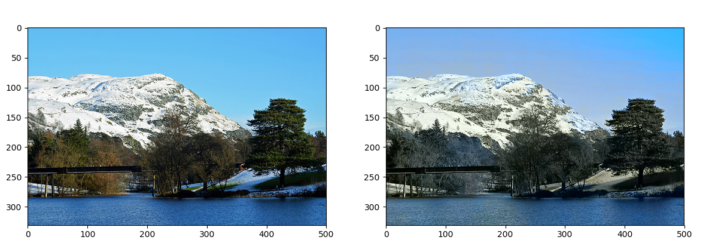

# Automatically colorize black and white images

## Idea
I use the SLIC algorithm to segment the image, then model the segments as a Random Markov Field and use ICM to optimize it. Each image is represented in the YUV color space. I use one predictor per color channel (for e.g. one SVR for U and one for V channel). Also, I use SURF descriptors as feauture vectors.

## Results

On the left is the original image, on the right is the colorized image.

